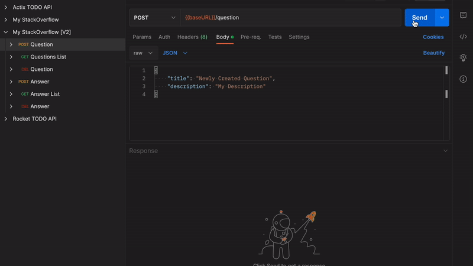

# Tech Q&A Backend API

## Problem Statement

An API is built for a StackOverflow-like app.



Basic CRUD operations are implemented for questions & answers:

1. Question creation, retrieval & deletion
2. Answer creation, retrieval & deletion

This project accomplishes the following:

- Designing & building APIs
- Using a backend framework (Axum)
- Designing SQL models
- Hands-on usage of Postgres
- Writing testable code
- Organizing code using modules

StackOverflow is an industry-standard forum for posting programming related questions and getting crowd-sourced answers. A user posts a question under the user's account, and other users can contribute different answers as they see most appropriate per question. There are additional features on StackOverflow, such as upvoting the question or its corresponding answers. However, question and answer creation, retrieval and deletion are the most primitive.

**Model**

Models describe how information is organized, transmitted or stored.

**Database / Storage / Persistence**

Database, storage and persistence are often used interchangeably. They represent the component we use to store and access information for the application.

**CRUD & DAO**

CRUD stands for actions of creation, read, update & deletion. DAO stands for data access object and is an interface in the application to perform these actions against the database.

**API (endpoints & models)**

For this project here are the API endpoints:

## Questions

**Question creation**

```
POST /question
```

Sample request

```json
{
  "title": "Newly Created Question",
  "description": "My Description"
}
```

Sample response

```json
{
  "question_uuid": "d347261c-3f0e-42d2-8706-5ef9f1b96725",
  "title": "Newly Created Question",
  "description": "My Description",
  "created_at": "2022-12-31 18:44:08.287442"
}
```

**Question retrieval**

```
GET /questions
```

Sample request

** No body for this request **

Sample response

```json
[
  {
    "question_uuid": "d347261c-3f0e-42d2-8706-5ef9f1b96725",
    "title": "Newly Created Question",
    "description": "My Description",
    "created_at": "2022-12-31 18:44:08.287442"
  }
]
```

Question deletion

```
DELETE /question
```

Sample request

```json
{
  "question_uuid": "8c8e50f0-0302-4e5f-beb5-11bfece813ab"
}
```

Sample response

** No body for this response. A 200 status code should be returned **

## Answers

**Answer creation**

```
POST /answer
```

Sample request

```json
{
  "question_uuid": "b068cd2f-edac-479e-98f1-c5f91008dcbd",
  "content": "test question"
}
```

Sample response

```json
{
  "answer_uuid": "a1a14a9c-ab9e-481b-8120-67f675531ed2",
  "question_uuid": "b068cd2f-edac-479e-98f1-c5f91008dcbd",
  "content": "test question",
  "created_at": "2022-12-31 13:11:59.728682"
}
```

**Answer retrieval**

```
GET /answers
```

Sample request

```json
{
  "question_uuid": "b068cd2f-edac-479e-98f1-c5f91008dcbd"
}
```

Sample response

```json
[
  {
    "answer_uuid": "a1a14a9c-ab9e-481b-8120-67f675531ed2",
    "question_uuid": "b068cd2f-edac-479e-98f1-c5f91008dcbd",
    "content": "test question",
    "created_at": "2022-12-31 13:11:59.728682"
  }
]
```

Answer deletion

```
DELETE /answer
```

Sample request

```json
{
  "answer_uuid": "df818bc0-dcfc-4129-bc38-a4d9c808d09c"
}
```

Sample response

** No body for this response. A 200 status code should be returned **

---

## Third Party Libraries

Rust has a minimal runtime, this means will need to use several third-party libraries to implement in the project.

### Tokio

[Tokio](https://tokio.rs/) is an asynchronous runtime for the Rust programming language. It provides the building blocks needed for writing network applications.

### Axum

One of the most popular server frameworks for Rust is [Axum](https://github.com/tokio-rs/axum). Axum is an ergonomic and modular web framework built by the Tokio team.

### Serde

[Serde](https://serde.rs/) is a framework for serializing and deserializing Rust data structures efficiently and generically.

In this project, Question and Answer records will be persisted in PostgreSQL. The tables are structured as follows:

### Question

| Name          | Type         | Description                                  |
| ------------- | ------------ | -------------------------------------------- |
| question_uuid | UUID         | Generated identifier unique to each question |
| title         | VARCHAR(255) | Title of the question                        |
| description   | VARCHAR(255) | Description of the question                  |
| created_at    | TIMESTAMP    | Creation timestamp of the question           |

### Answer

| Name          | Type         | Description                                  |
| ------------- | ------------ | -------------------------------------------- |
| answer_uuid   | UUID         | Generated identifier unique to each answer   |
| question_uuid | UUID         | Generated identifier unique to each question |
| content       | VARCHAR(255) | Content of the answer                        |
| created_at    | TIMESTAMP    | Creation timestamp of the answer             |

## Third Party Libraries

A few additional dependencies have been added to help integrate our the app with PostgreSQL.

### SQLx

[SQLx](https://github.com/launchbadge/sqlx) is an async SQL driver featuring compile-time checked queries. This is used to execute SQL queries against our Postgres database.

### dotenvy

[dotenvy](https://crates.io/crates/dotenvy) loads environment variables from a .env file, if available, and mashes those with the actual environment variables provided by the operative system. This library is used to store the Postgres connection URL inside the .env file.

### log & pretty_env_logger

[log](https://crates.io/crates/log) & [pretty_env_logger](https://crates.io/crates/pretty_env_logger) will allow logging to the console while the server is running.

## Docker & Postgres Setup

**Docker**

1. [Install Docker](https://www.docker.com/)
2. Install the [Postgres image](https://hub.docker.com/_/postgres) by running `docker pull postgres` in your terminal
3. Start a Postgres instance by running:
   `shell
$ docker run --name stack-overflow-db -e POSTGRES_PASSWORD=postgrespw -p 55008:5432 -d postgres
`
   A visual client is used to see the state of the database:

4. [Install pgAdmin 4](https://www.pgadmin.org/download/)
5. Register a new server with the following properties:
   - name: stack-overflow-db
   - hostname/address: localhost
   - port: 55008
   - username: postgres
   - password: postgrespw
6. You should now be able to connect to your PostgreSQL server instance

## Postgres

Run the migrations to setup the Postgres DB.

First, install [sqlx-cli](https://github.com/launchbadge/sqlx/tree/main/sqlx-cli). This is SQLx's associated command-line utility for managing databases, migrations, and more:

```shell
$ cargo install sqlx-cli
```

Execute migrations by running:

```shell
$ sqlx migrate run
```

**NOTE:** If you ever want to revert the migrations, simply run:

```shell
$ sqlx migrate revert
```

Then run the server using `cargo run` or cargo watch:

```shell
$ cargo watch -q -c -w src/ -x run
```
